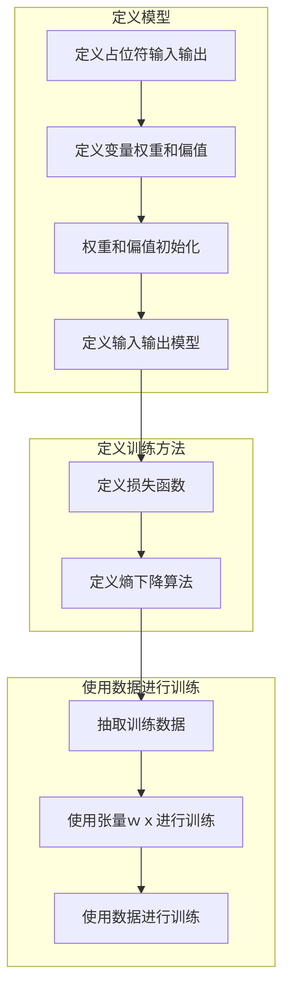

# 概述

 分析一个线性层的softmax回归模型相关概念

# 概念

|概念|含义|应用场景|描述格式|说明|
|-|-|-|-|-|
|占位符| 占位符不是特殊的值，而是一个值的代数符号|通常需要定义输入和输出占位符| x=tf.placeholder("float", shape=[None, 784]) | 定义浮点类型的张量, 第一维度为需要训练的数据个数，不确定。 第二维度是一张图片的点阵大小|
|变量|计算图中的一个值，能够在计算过程中使用，甚至进行修改。在机器学习的应用过程中，模型参数一般用Variable来表示  |描述权重W和偏置b | W = tf.Variable(tf.zeros([784,10])) | W是一个784x10的矩阵（因为我们有784个特征和10个输出值） |  


# 工作流


#定义模型

## 定义占位符输入输出

```python
x = tf.placeholder("float", shape=[None, 784])
y_ = tf.placeholder("float", shape=[None, 10])
```

## 定义变量权重和偏值

```python
W = tf.Variable(tf.zeros([784,10]))
b = tf.Variable(tf.zeros([10]))
```

## 权重和偏值初始化

```python
sess.run(tf.initialize_all_variables())
```

## 定义输入输出模型
 
 套用softcomm模型进行预测

 ```python
 y = tf.nn.softmax(tf.matmul(x,W) + b)
 ```

#定义训练方法

## 定义损失函数

```python
cross_entropy = -tf.reduce_sum(y_*tf.log(y))
```

## 定义熵下降算法

我们用最速下降法让交叉熵下降，步长为0.01.

```
train_step = tf.train.GradientDescentOptimizer(0.01).minimize(cross_entropy)
```

# 开始训练

## 抽取训练数据

```
for i in range(1000):
  batch = mnist.train.next_batch(50)
  train_step.run(feed_dict={x: batch[0], y_: batch[1]})
```

##　使用张量ｗｘ进行训练

本次train_step已经记录了上次的ｗｘ，无需再次设置

## 使用数据进行训练
 
 传递输入，输出数据进行训练
  

```
  train_step.run(feed_dict={x: batch[0], y_: batch[1]})
```